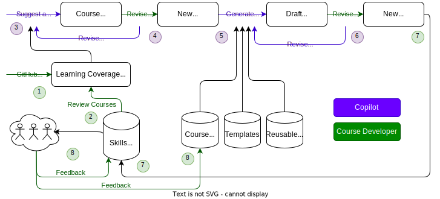

# Skills Manager

This is a toolkit for developing and managing GitHub Skills and related Actions workflows. Please use the below guides to get started with this toolkit and for creating new courses.

## How to Develop

- [Initial Setup](docs/initial-setup.md) - A step-by-step guide to start developing.
- [Develop a Skill Course](docs/develop-a-skill-course.md) - Important tasks and guidelines.

### New Course Flowchart

1. Critical GitHub features are added to a learning coverage map.
2. Existing Skills courses are reviewed and the coverage map is updated.
3. Copilot is prompted to analyze the learning coverage map and suggest a course outline.
4. The Course Developer revises the outline, either directly or with additional prompts to Copilot.
5. Copilot is prompted to produce a draft course using the new outline and existing course guidelines, templates, etc.
6. The Course Developer revises the course, either directly or with additional prompts to Copilot.
7. The new skill is finished and added to the catalog.
8. After some usage, feedback is used to update the existing course(s) and guidelines.

> [!IMPORTANT]
> The guidelines do not currently include suggestions for automated tests, user acceptance, or other QA suggestions.