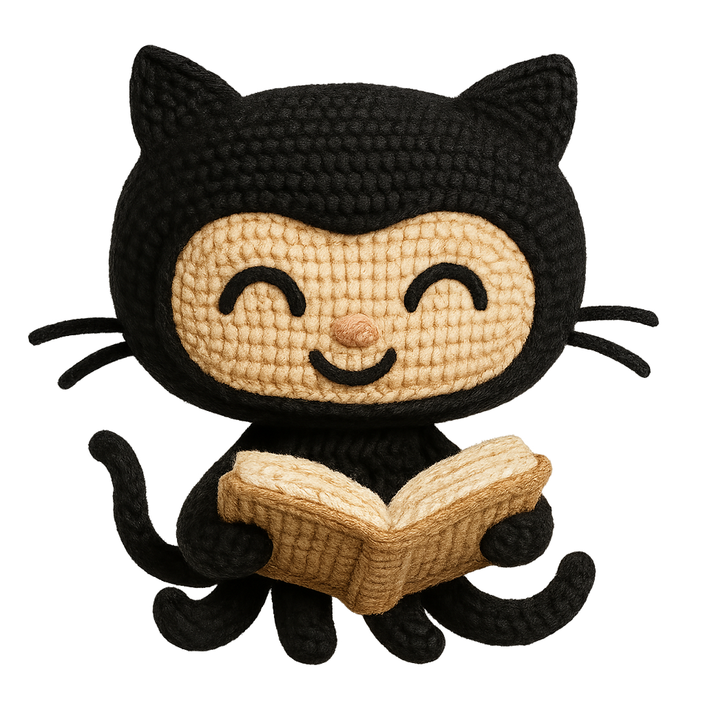
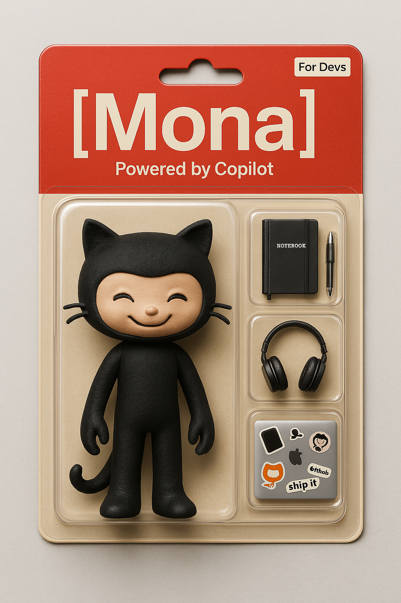
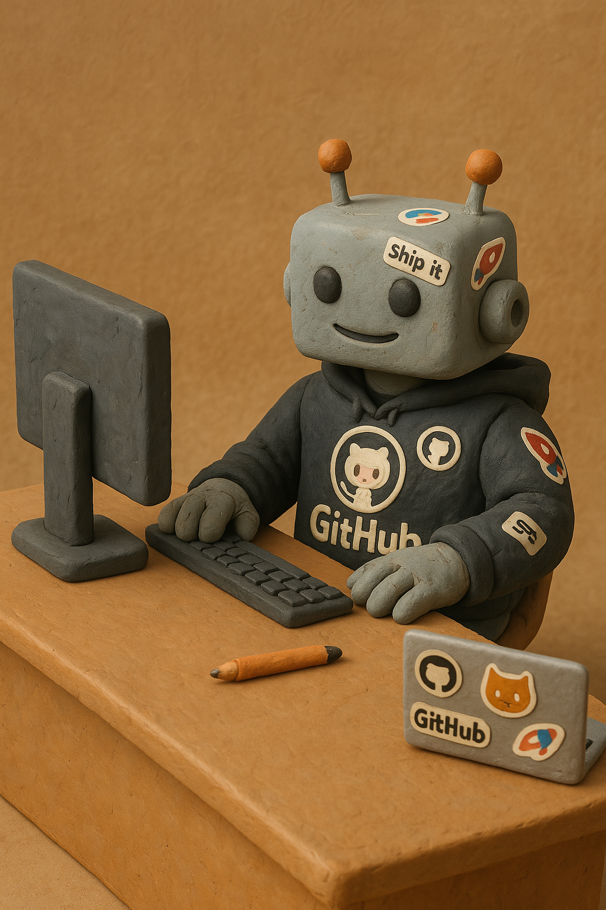
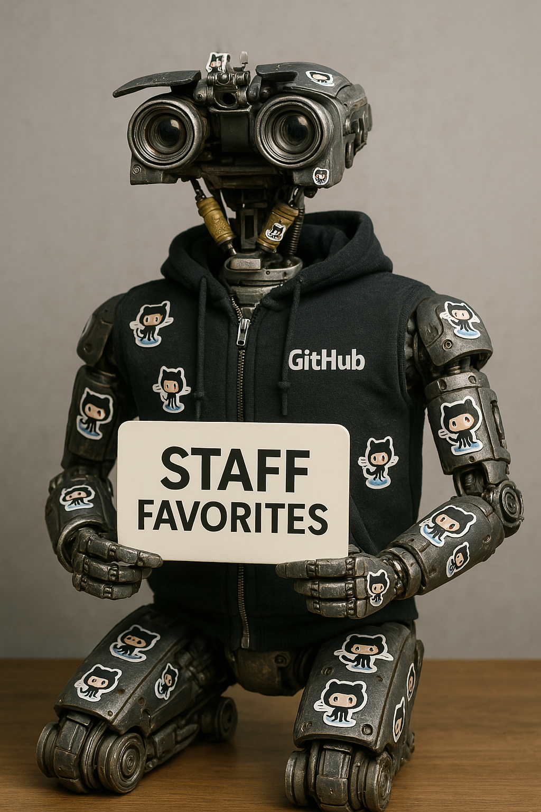

# Generate Prototype images to match with exercises

Below are example prompts for Chat-GPT for generating images that may make our exercises more engaging. This is experimental, so be careful about following legal and branding rules.

## Knitted Mona

> **Prompt**  
> Using this image style which looks like knitting, create an image with a transparent background and create Mona the GitHub mascot looking happy and reading (I attached the image you see)

  

### Result

## Action Figure

> **Prompt**  
> Using Mona the GitHub Mascot, create a realistic action figure in a blister pack, styled like a premium collectible toy. The figure should be posed standing upright. The blister pack should have a red header with the text '[Mona]' in large white letters, and below it, 'Powered by Copilot' in smaller white letters. Add an 'For Devs' label in the top right corner of the header. Include accessories in compartments on the right side of the figure: a notebook, a pen, mac pro a headphones, and an apple laptop with many GitHub stickers on it. The background of the blister pack should be beige. Ensure the action figure is rendered in high detail with photorealistic quality.

### Result

## Robot - clay

> **Prompt:**
> I want you to draw a claymation robot wearing a github hoodie, with github stickers all over its body, sitting and working at a desk with a monitor and keyboard, without anyone else in the photo

### Result

## Robot - realistic

> **Prompt:**
> I want you to make the robot photorealistic robot wearing a github hoodie, with github stickers all over its body, holding a sign that says "Staff Favorites". The robot should look like the one from short circuit.

### Result

