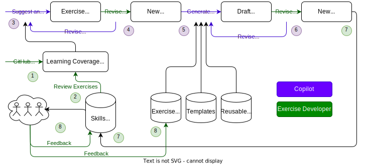

# Make an Exercise

The following are guidelines and recommendations. They will help quickly create a new draft-quality exercise with the help of Copilot, which you can then manually refine.

This outline represents where we are heading. Almost there! 🚀🧑‍🚀



1. Critical GitHub features are added to a learning coverage map.
2. Existing Skills exercise are reviewed and the learning coverage map is updated.
3. Copilot is prompted to analyze the learning coverage map and suggest an exercise outline.
4. The Exercise Developer revises the outline, either directly or with additional prompts to Copilot.
5. Copilot is prompted to produce a draft exercise using the new outline and existing exercise guidelines, templates, etc.
6. The Exercise Developer revises the exercise, either directly or with additional prompts to Copilot.
7. The new skill is finished and added to the catalog.
8. After some usage, feedback is used to update the existing exercise(s) and guidelines.

## Tools

The [Exercise Toolkit](https://github.com/skills/exercise-toolkit) repository provides reusable workflows and markdown templates.

The [Exercise Template](https://github.com/skills/exercise-template) repository is a repository template used to bootstrap a new exercise. When creating a new exercise it is recommended to use this as a starting point.

## How to make an exercise

If you are unfamiliar with the architecture and flow of an exercise, please see the [Exercise docs](../reference/exercise.md).

1. Open your exercise outline. If you don't have one, please follow the [make an outline](make-an-outline.md) guide.

1. Prompt Copilot to create the exercise.

   > 
   >
   > ```prompt
   > /bootstrap-exercise-from-outline
   > ```

1. Use the [Step Formatting](../reference/step-formatting.md) recommendations to make your exercise more enjoyable.

   > ❗️ **IMPORTANT:** Images should not be stored in the repository. Relative links do not work when the text is copied to the issue. Use absolute links.

1. Use the checklists to to prepare for publishing.

   - [Repository files](checklist/repository-files.md) checklist
   - [Repository settings](checklist/repository-settings.md) checklist

   > 💡 **TIP:** If you saved the exercise outline as an issue, add these checklists as comments.

1. Ask Copilot to review your exercise.

   > 
   >
   > ```prompt
   > /review-exercise
   > ```

1. Use the [testing guide](test-an-exercise.md) to validate the exercise.

   - Assume the role of the learner and try to break it.
   - Share it internally to get feedback.

1. Use the [publishing checklist](checklist/publishing.md) to release the exercise to your account or an organization.
